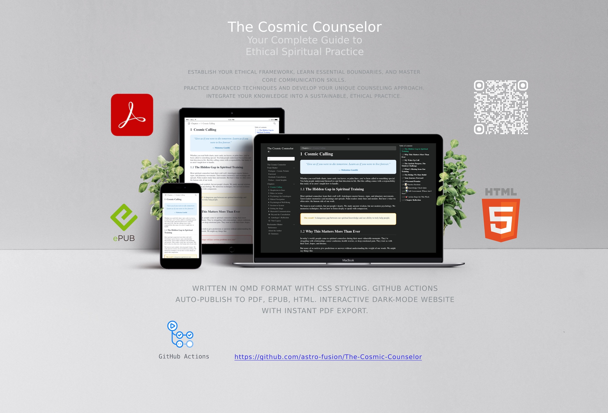

# The Cosmic Counselor

<!-- badges: start -->
[](https://github.com/astro-fusion/The-Cosmic-Counselor/actions)
[](https://astro-fusion.github.io/The-Cosmic-Counselor)
[](LICENSE)
[](https://github.com/astro-fusion/The-Cosmic-Counselor/discussions)
<!-- badges: end -->



This repository contains the source files for **The Cosmic Counselor: Ethical Spiritual Guidance in Modern Times**, a comprehensive guide for astrologers, tarot readers, and other spiritual counselors seeking to practice with integrity and compassion.

## 📖 Read the Book

### 🌍 Multilingual Versions

| Language | Online Version | PDF | EPUB |
|----------|----------------|-----|------|
| 🇺🇸 **English** | [Live Website](https://astro-fusion.github.io/The-Cosmic-Counselor) | [Download](https://github.com/astro-fusion/The-Cosmic-Counselor/releases) | [Download](https://github.com/astro-fusion/The-Cosmic-Counselor/releases) |
| 🇮🇳 **Hindi** | [हिंदी वर्जन](https://astro-fusion.github.io/The-Cosmic-Counselor/hi) | [डाउनलोड](https://github.com/astro-fusion/The-Cosmic-Counselor/releases) | [डाउनलोड](https://github.com/astro-fusion/The-Cosmic-Counselor/releases) |
| 🇳🇵 **Nepali** | [नेपाली वर्जन](https://astro-fusion.github.io/The-Cosmic-Counselor/ne) | [डाउनलोड](https://github.com/astro-fusion/The-Cosmic-Counselor/releases) | [डाउनलोड](https://github.com/astro-fusion/The-Cosmic-Counselor/releases) |

### 🚀 Quick Preview Commands
```bash
# English
quarto preview

# Hindi  
quarto preview --project translations/hi/_quarto.yml

# Nepali
quarto preview --project translations/ne/_quarto.yml
```

## 🌟 About the Book

The Cosmic Counselor bridges ancient wisdom with modern ethical practices, providing universal principles for responsible spiritual counseling. Whether you read birth charts, tarot cards, palms, or numbers, this book offers essential guidance for ethical practice.

**Target Audience:** Astrologers, tarot readers, numerologists, palmists, and spiritual counselors worldwide seeking ethical guidance.

**Key Topics:**

- ✨ Ethical guidelines for spiritual practice
- 🧠 Basic psychology for spiritual counselors  
- 🤝 Building trust and active listening skills
- 🔄 When and how to refer clients to mental health professionals
- 🛡️ Self-care and professional boundaries
- 🌍 Cultural sensitivity in spiritual practice
- 💫 Building a sustainable spiritual practice

## 🚀 Cross-Platform Publishing

**QMD-powered publishing with CSS styling. Auto-generates PDF, EPUB, HTML via GitHub Actions. Interactive dark-mode website with instant PDF export.**

### 📱 Multiple Format Support

| Format | Features | Access |
|--------|----------|--------|
| 🌐 **HTML** | Interactive elements, dark mode, responsive design, language switcher | [Live Website](https://astro-fusion.github.io/The-Cosmic-Counselor) |
| 📄 **PDF** | Print-optimized, professional layout, one-click export | [Download](https://github.com/astro-fusion/The-Cosmic-Counselor/releases) |
| 📱 **EPUB** | E-reader compatible, mobile-friendly | [Download](https://github.com/astro-fusion/The-Cosmic-Counselor/releases) |
| 📝 **QMD** | Source format for easy editing and collaboration | [View Source](https://github.com/astro-fusion/The-Cosmic-Counselor) |

### 🌍 Multilingual Features

- **Language Switcher**: Seamless switching between English, Hindi, and Nepali
- **Separate URLs**: Each language has its own dedicated website
- **Localized Content**: Full translation of all chapters, exercises, and navigation
- **Script Support**: Proper Devanagari rendering for Hindi and Nepali

### 🎨 Publishing Features

**Automated Workflow:**

- ✅ GitHub Actions integration for seamless publishing
- ✅ CSS styling system for consistent design
- ✅ Multi-format output from single source
- ✅ Interactive web features with dark mode support
- ✅ One-click PDF export functionality
- ✅ Mobile-responsive design across all formats

## 🏗️ Repository Structure

```
The-Cosmic-Counselor/
├── _quarto.yml              # Main English configuration
├── index.qmd                # Book homepage & overview
├── frontmatter/             # Pre-chapter content
│   ├── prologue.qmd         # Cosmic Prelude
│   ├── foreword.qmd         # Foreword by guest author
│   ├── gratitude.qmd        # Gratitude Constellation  
│   └── preface.qmd          # Author's preface
├── chapters/                # Main book chapters (12 chapters)
│   ├── chapter-01.qmd       # Cosmic Calling
│   ├── chapter-02.qmd       # Skepticism to Stars
│   ├── chapter-03.qmd       # Ethics in Action
│   ├── chapter-04.qmd       # Ethical Navigation
│   ├── chapter-05.qmd       # Ethical Navigation
│   ├── chapter-06.qmd       # Knowing When to Refer
│   ├── chapter-07.qmd       # Session to System
│   ├── chapter-08.qmd       # Setting the Stage
│   ├── chapter-09.qmd       # Masterful Communication
│   ├── chapter-10.qmd       # Beyond the Consultation
│   ├── chapter-11.qmd       # Astrologer's Reflection
│   ├── chapter-12.qmd       # Your Legacy
│   └── chapter-XX/          # Chapter subdirectories with:
│       ├── index.qmd        # Main chapter content
│       ├── practice.qmd     # Interactive exercises
│       └── quiz.qmd         # Knowledge assessments
├── backmatter/              # Post-chapter content
│   ├── author.qmd           # About the author
│   ├── references.qmd       # Bibliography & resources
│   └── summary.qmd          # Book summary & key takeaways
├── translations/            # 🌍 Multilingual translations
│   ├── hi/                  # Hindi translations
│   │   ├── _quarto.yml      # Hindi configuration
│   │   ├── index.qmd        # Hindi homepage
│   │   ├── chapters/        # Hindi chapter files
│   │   ├── frontmatter/     # Hindi frontmatter
│   │   └── backmatter/      # Hindi backmatter
│   └── ne/                  # Nepali translations
│       ├── _quarto.yml      # Nepali configuration
│       ├── index.qmd        # Nepali homepage
│       ├── chapters/        # Nepali chapter files
│       ├── frontmatter/     # Nepali frontmatter
│       └── backmatter/      # Nepali backmatter
├── images/                  # Visual assets (shared)
│   └── cover.png            # Book cover image
├── styles/                  # Custom styling (shared)
│   └── global.css           # Unified book styles + language switcher
├── scripts/                 # Interactive features (shared)
│   ├── language-switcher.js # Language switching component
│   ├── include-scripts.html # Script includes
│   └── quiz-interactions.js # Quiz functionality
├── build-all.sh             # Build script for all languages
├── MULTILINGUAL_SETUP.md    # Multilingual setup guide
├── .github/workflows/       # GitHub Actions for publishing
│   └── publish.yml          # Auto-build and deploy all languages
├── _book/                   # Generated book output (auto-generated)
│   ├── index.html           # English version
│   ├── hi/                  # Hindi version
│   └── ne/                  # Nepali version
└── README.md               # This file
```

## 🚀 Automated Publishing

This project uses GitHub Actions to automatically:

- **📝 Build HTML version** and deploy to GitHub Pages
- **📄 Generate PDF and EPUB** formats  
- **🚀 Create releases** with downloadable files
- **🔄 Update on every push** to the main branch

### Available Formats

| Language | HTML | PDF | EPUB | Updates |
|----------|------|-----|------|---------|
| 🇺🇸 **English** | [Live](https://astro-fusion.github.io/The-Cosmic-Counselor) | [Download](https://github.com/astro-fusion/The-Cosmic-Counselor/releases) | [Download](https://github.com/astro-fusion/The-Cosmic-Counselor/releases) | Automatic |
| 🇮🇳 **Hindi** | [Live](https://astro-fusion.github.io/The-Cosmic-Counselor/hi) | [Download](https://github.com/astro-fusion/The-Cosmic-Counselor/releases) | [Download](https://github.com/astro-fusion/The-Cosmic-Counselor/releases) | Automatic |
| 🇳🇵 **Nepali** | [Live](https://astro-fusion.github.io/The-Cosmic-Counselor/ne) | [Download](https://github.com/astro-fusion/The-Cosmic-Counselor/releases) | [Download](https://github.com/astro-fusion/The-Cosmic-Counselor/releases) | Automatic |

## 🛠️ Local Development

### Prerequisites
- [Quarto CLI](https://quarto.org/docs/get-started/) installed
- Git for version control

### Quick Start
```bash
# Clone the repository
git clone https://github.com/astro-fusion/The-Cosmic-Counselor.git
cd The-Cosmic-Counselor

# Preview English version (auto-refreshes on changes)
quarto preview

# Preview other languages
quarto preview --project translations/hi/_quarto.yml  # Hindi
quarto preview --project translations/ne/_quarto.yml  # Nepali

# Build all languages and formats
./build-all.sh

# Build specific language
quarto render --project translations/hi/_quarto.yml --to html,pdf,epub
```

### Development Commands
```bash
# Preview single chapter
quarto preview chapters/chapter-01.qmd

# Preview translated chapters
quarto preview translations/hi/chapters/chapter-01.qmd
quarto preview translations/ne/chapters/chapter-01.qmd

# Render without opening browser
quarto render --quiet

# Check for issues
quarto check
quarto check --project translations/hi/_quarto.yml
quarto check --project translations/ne/_quarto.yml
```

## 📚 Building Different Formats

### Generate All Formats Locally

```bash
# Build all formats (HTML, PDF, EPUB)
quarto render

# Build specific formats
quarto render --to html    # Web version with interactive features
quarto render --to pdf     # Print-ready PDF with static content
quarto render --to epub    # E-reader compatible format
```

## 🌍 Multilingual Development

### Build All Languages

```bash
# Build all languages and formats
./build-all.sh

# Build specific language
quarto render --project translations/hi/_quarto.yml --to html,pdf,epub
quarto render --project translations/ne/_quarto.yml --to html,pdf,epub
```

### Translation Workflow

1. **Add content to English version first**
2. **Create corresponding files in language directories**
3. **Translate content while maintaining structure**
4. **Test builds for each language**
5. **Update build script if needed**

### Language-Specific Commands

```bash
# Preview individual languages
quarto preview --project translations/hi/_quarto.yml  # Hindi
quarto preview --project translations/ne/_quarto.yml  # Nepali

# Check language-specific configurations
quarto check --project translations/hi/_quarto.yml
quarto check --project translations/ne/_quarto.yml

# Build specific language formats
quarto render --project translations/hi/_quarto.yml --to html
quarto render --project translations/ne/_quarto.yml --to pdf
```

### Format-Specific Features

| Feature | HTML | PDF | EPUB |
|---------|------|-----|------|
| 🖱️ **Interactive Elements** | ✅ Buttons, collapsible content | ❌ Static only | ❌ Static only |
| 📱 **Navigation** | ✅ Dynamic TOC, search | ✅ Static TOC | ✅ Chapter navigation |
| 🎨 **Styling** | ✅ Full CSS, animations | ✅ Print-optimized | ✅ E-reader adapted |
| 📖 **Reading Experience** | ✅ Web-based | ✅ Print-ready | ✅ E-reader optimized |

### Content Adaptation

The book automatically adapts content for different formats:

- **🌐 HTML Version**: Interactive quizzes, collapsible answers, dynamic styling
- **📄 PDF Version**: Static quiz questions with answer keys, print-optimized layout
- **📱 EPUB Version**: E-reader friendly formatting with embedded answers

### Chapter Structure

Each chapter follows a consistent three-part structure:

```bash
chapters/chapter-XX/
├── index.qmd        # Main chapter content and concepts
├── practice.qmd     # Hands-on exercises and assessments
└── quiz.qmd         # Knowledge checks and self-evaluation
```

This modular approach allows for:
- **Focused learning** - Theory, practice, and assessment separated
- **Easy maintenance** - Update content without affecting structure
- **Format flexibility** - Combine or separate sections as needed

### Local Development Workflow

```bash
# 1. Preview while writing (auto-refresh)
quarto preview

# 2. Test specific format
quarto render --to pdf

# 3. Check all formats before publishing
quarto render --clean  # Clean build
quarto render          # Build all formats

# 4. Verify output
ls -la _book/
```

### Troubleshooting Local Builds

**PDF Issues:**
```bash
# Install/update TinyTeX
quarto install tinytex

# Check TinyTeX installation
quarto check
```

**Missing Styles:**
```bash
# Verify CSS compilation
quarto render --to html --quiet
find _book/ -name "*.css"
```

**EPUB Issues:**
```bash
# Check EPUB structure
unzip -l _book/The-Cosmic-Counselor.epub
```

**Interactive Features:**
```bash
# Test JavaScript functionality
python -m http.server 8000 -d _book/
# Open http://localhost:8000 to test interactive elements
```

## 🤝 Community & Discussions

Join our growing community of ethical spiritual practitioners!

**💬 [GitHub Discussions](https://github.com/astro-fusion/The-Cosmic-Counselor/discussions)**

- 💡 **Ideas & Suggestions** - Propose improvements
- ❓ **Q&A** - Ask questions about spiritual counseling  
- 📖 **Book Discussion** - Chapter-by-chapter conversations
- 🌟 **Success Stories** - Share your growth and achievements
- 🔧 **Resources & Tools** - Share helpful materials
- 🤝 **Introductions** - Welcome new community members

### 🌈 Community Values
- 💝 Compassionate communication in all interactions
- 🌍 Respect for diverse spiritual paths and traditions  
- 🔒 Confidentiality when discussing sensitive topics
- ⚖️ Ethical boundaries in all guidance and advice
- 📚 Continuous learning and humility in practice

## 🎯 Contributing

We welcome contributions from spiritual practitioners worldwide! Here's how you can help:

### 📝 Content Contributions
- **Chapter improvements** - Enhance existing content
- **Case studies** - Share anonymized examples (with consent)
- **Practice exercises** - Suggest new activities and assessments
- **Cultural perspectives** - Add insights from different traditions
- **🌍 Translations** - Help translate into additional languages

### 🔧 Technical Contributions  
- **Proofreading** - Fix typos and improve clarity
- **Translation infrastructure** - Improve multilingual setup
- **Styling** - Improve book design and accessibility
- **Documentation** - Enhance setup and usage instructions
- **Language switcher** - Enhance multilingual navigation

### 🚀 How to Contribute
1. **Fork** this repository
2. **Create** a feature branch (`git checkout -b feature/your-improvement`)
3. **Make** your changes following our guidelines
4. **Test** the build: `quarto render`
5. **Submit** a pull request with clear description

### 📋 Contribution Guidelines
- ✅ Maintain the book's ethical focus
- ✅ Use inclusive, accessible language  
- ✅ Respect cultural sensitivity
- ✅ Include proper citations for referenced material
- ✅ Test all changes before submitting

## 🔄 Current Status & Roadmap

### ✅ Completed
- [x] Project structure and automation
- [x] All 12 chapters with structured content (index/practice/quiz)
- [x] Automated publishing workflow
- [x] Community discussions setup
- [x] Multi-format output (HTML, PDF, EPUB)
- [x] Interactive features and styling system
- [x] **Multilingual setup** (English, Hindi, Nepali)
- [x] **Language switcher** component
- [x] **Separate language builds** and deployments

### 🔄 In Progress  
- [ ] Content refinement and editing
- [ ] Additional practice exercises
- [ ] Enhanced interactive features
- [ ] Community contribution guidelines

### 📋 Planned
- [ ] Additional language translations (Spanish, French, etc.)
- [ ] Audio/video companion content
- [ ] Mobile app version
- [ ] Advanced assessment tools
- [ ] Translation management system

## 📜 License

This work is licensed under [Creative Commons Attribution-ShareAlike 4.0 International](https://creativecommons.org/licenses/by-sa/4.0/).

**You are free to:**

- ✅ **Share** - copy and redistribute in any medium or format
- ✅ **Adapt** - remix, transform, and build upon the material
- ✅ **Commercial use** - use for commercial purposes

**Under these conditions:**

- 📝 **Attribution** - Give appropriate credit with link to license
- 🔄 **ShareAlike** - Distribute adaptations under the same license
- 🚫 **No additional restrictions** - No legal/technological measures that legally restrict others

## 👤 Author & Contact

**Bishal Ghimire**  
*Spiritual Counselor & Ethical Practice Advocate*

- 📧 **Email**: astrofusion369@gmail.com  
- 🌐 **Website**: [astro-fusion.com](https://astro-fusion.com)
- 💬 **Discussions**: [Book Community](https://github.com/astro-fusion/The-Cosmic-Counselor/discussions)
- 🐛 **Issues**: [Report Problems](https://github.com/astro-fusion/The-Cosmic-Counselor/issues)

## 🙏 Acknowledgments

This book exists thanks to:

- 🌟 Wisdom shared by spiritual teachers across traditions
- 🤝 Trust of countless clients who shaped these insights
- 👥 Support of family, friends, and the spiritual community
- 💝 All contributors who help make this resource better

Special gratitude to everyone working to elevate ethical standards in spiritual practice.

## 📋 Code of Conduct

The Cosmic Counselor project follows a [Contributor Code of Conduct](CODE_OF_CONDUCT.md). By participating, you agree to create a welcoming, harassment-free experience for everyone, regardless of:

- 🌍 Spiritual practice or tradition
- 🏛️ Cultural background  
- 📚 Experience level
- 🆔 Personal identity

We are committed to building an inclusive community focused on ethical spiritual growth.

---

*May your practice bring healing to yourself and others* 🙏✨
